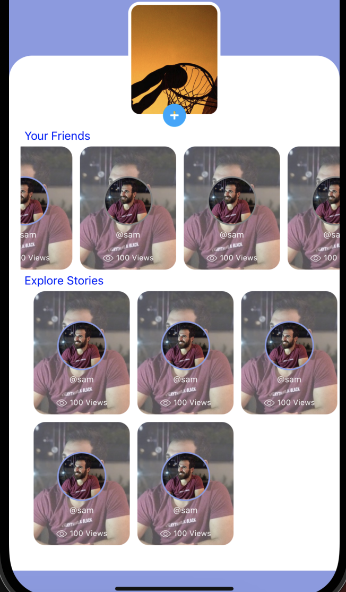
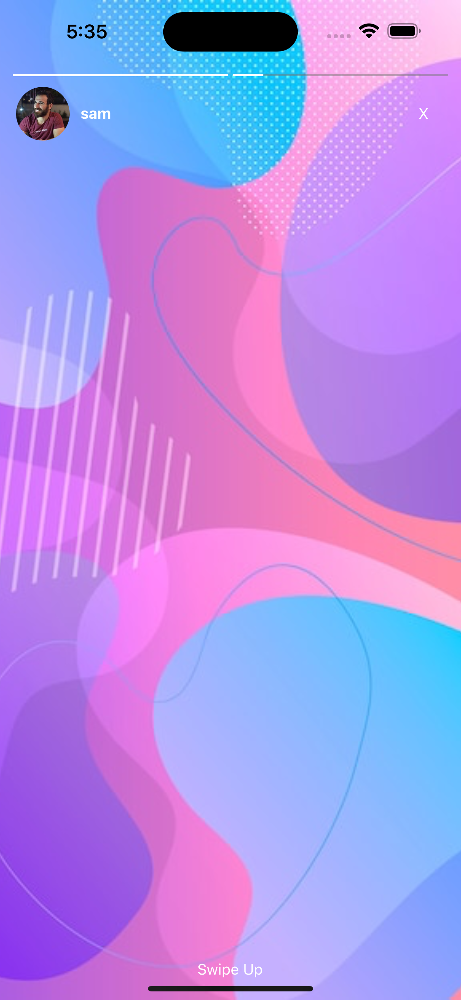
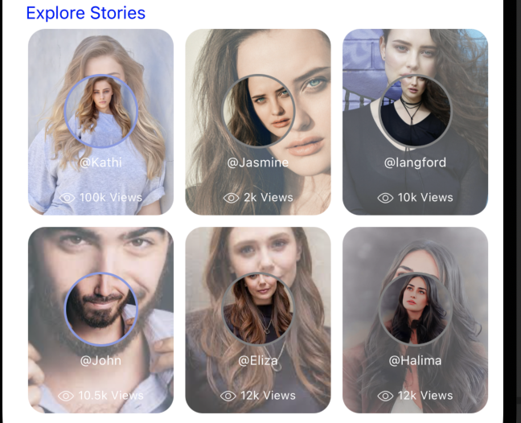

# react-native-video-insta-story

### It's a customised user stories for react native with video and a card style view

#### I'm still working on it to make it more flexible and easy to use. you can write me your quries and questions at (Shahid.chawdhary07@gmail.com)

## Author Shahid Chawdhary

<p align="center">


</p>

## Install

#### 1. Step

```javascript
npm install react-native-video-insta-story --save
```

or

```javascript
yarn add react-native-video-insta-story
```

#### 2. Step

```javascript
cd ios && pod install
```

## Import

```javascript
import InstaStory from 'react-native-video-insta-story';
```

## Props

| Name                       | Description                                         | Type          | Default Value |
| :------------------------- | :-------------------------------------------------- | :------------ | :-----------: |
| data                       | Array of IUserStory. You can check from interfaces. | object        |               |
| unPressedBorderColor       | Unpressed border color of profile circle            | color         |      red      |
| pressedBorderColor         | Pressed border color of profile circle              | color         |     grey      |
| unPressedAvatarTextColor   | Unpressed avatar text color                         | color         |      red      |
| pressedAvatarTextColor     | Pressed avatar text color                           | color         |     grey      |
| onStorySeen                | Called each time story is seen                      | function      |     null      |
| onClose                    | Todo when close                                     | function      |     null      |
| onStart                    | Todo when start                                     | function      |     null      |
| duration                   | Per story duration seconds                          | number        |      10       |
| swipeText                  | Text of swipe component                             | string        |   Swipe Up    |
| renderSwipeUpComponent     | Render a custom swipe up component                  | function      |               |
| renderCloseComponent       | Render a custom close button                        | function      |               |
| renderTextComponent        | Render custom avatar text component                 | function      |               |
| avatarSize                 | Size of avatar circle                               | number        |      60       |
| showAvatarText             | For show or hide avatar text.                       | bool          |     true      |
| avatarTextStyle            | For avatar text style                               | TextStyle     |               |
| avatarImageStyle           | For avatar image style                              | ImageStyle    |               |
| avatarWrapperStyle         | For individual avatar wrapper style                 | ViewStyle     |               |
| avatarFlatListProps        | Horizontal avatar flat list props                   | FlatListProps |               |
| loadedAnimationBarStyle    | For loaded animation bar style                      | ViewStyle     |               |
| unloadedAnimationBarStyle  | For unloaded animation bar style                    | ViewStyle     |               |
| animationBarContainerStyle | For animation bar container style                   | ViewStyle     |               |
| storyUserContainerStyle    | For story item user container style                 | ViewStyle     |               |
| storyImageStyle            | For story image style                               | ImageStyle    |               |
| storyAvatarImageStyle      | For story avatar image style                        | ImageStyle    |               |
| storyContainerStyle        | For story container style                           | ViewStyle     |               |
| horizontal={true}          | for showing horizontal stories                      | boolean       |               |
| horizontal={false}         | for showing vertical stories                        | boolean       |               |
| numColumns                 | for showing columns                                 | number        |               |

## Usage

#### First let's have a look at horizonatal user stories,(you can use horizontal or vertical stories)

### Basic for horizonatal stories

```javascript
import InstaStory from 'react-video-native-insta-story';

const storyData =[
  {
  "user_id": 1,
  "user_image":
  'https://pbs.twimg.com/profile_images/1222140802475773952/61OmyINj.jpg',
  "user_name": 'sam',
  "views": "100k",
  "stories": [
    {
      "story_id": 1,
      "story_likes": "1k",
      "story_views":"2k",
      "story_video":
        'https://www.learningcontainer.com/wp-content/uploads/2020/05/sample-mp4-file.mp4',
      "swipeText": 'Custom swipe text for this story',
      "onPress": () => console.log('story 1 swiped'),
    },
    {
      "story_id": 2,
      "story_likes": "2k",
      "story_views":"10k",
      "story_video":
        'https://commondatastorage.googleapis.com/gtv-videos-bucket/sample/BigBuckBunny.mp4',
    },
  ],
},
{
  "user_id": 1,
  "user_image":
  'https://i.ibb.co/f83vDyh/profile1.jpg',
  "user_name": 'Fab',
  "views": "2k",
  "stories": [
    {
      "story_id": 1,
      "story_likes": "1k",
      "story_views":"2k",
      "story_image":
        'https://i.ibb.co/f83vDyh/profile1.jpg',
      "swipeText": 'Custom swipe text for this story',
      "onPress": () => console.log('story 1 swiped'),
    },
    {
      "story_id": 2,
      "story_likes": "100",
      "story_views":"3k",
      "story_image":
        'https://i.ibb.co/WFkJJ07/profile2.jpg',
    },
  ],
},
{
  "user_id": 1,
  "user_image":
  'https://i.ibb.co/WFkJJ07/profile2.jpg',
  "user_name": 'Zee',
  "views": "10k",
  "stories": [
    {
      "story_id": 1,
      "story_likes": "3.5k",
      "story_views":"5k",
      "story_image":
        'https://i.ibb.co/pxQZ2Dj/profile3.jpg',
      "swipeText": 'Custom swipe text for this story',
      "onPress": () => console.log('story 1 swiped'),
    }
  ],
},
{
  "user_id": 1,
  "user_image":
  'https://i.ibb.co/pxQZ2Dj/profile3.jpg',
  "user_name": 'John',
  "views": "10.5k",
  "stories": [
    {
      "story_id": 1,
      "story_likes": "1k",
      "story_views":"10k",
      "story_image":
      'https://i.ibb.co/f83vDyh/profile1.jpg',
      "swipeText": 'Custom swipe text for this story',
      "onPress": () => console.log('story 1 swiped'),
    },
    {
      "story_id": 2,
      "story_likes": "2k",
      "story_views":"2k",
      "story_image":
      'https://i.ibb.co/pxQZ2Dj/profile3.jpg',
    },
  ],
},
{
  "user_id": 1,
  "user_image":
  'https://i.ibb.co/7rx3xfJ/profile4.jpg',
  "user_name": 'Eliza',
  "views": "12k",
  "stories": [
    {
      "story_id": 1,
      "story_likes": "10k",
      "story_views":"12k",
      "story_image":
      'https://i.ibb.co/7rx3xfJ/profile4.jpg',
      "swipeText": 'Custom swipe text for this story',
      "onPress": () => console.log('story 1 swiped'),
    },
    {
      "story_id": 2,
      "story_likes": "18k",
      "story_views":"20k",
      "story_image":
        'https://i.ibb.co/0rMM0pX/profile5.jpg',
    },
  ],
}
]

 <InstaStory
          style={{marginLeft: 10}}
          horizontal={true}
          data={storyData}
          duration={10}
        />;
```

#### horizontal view

<p align="center">

</p>

### Basic for vertical 3 column stories

```javascript
import InstaStory from 'react-video-native-insta-story';

const storyData =[
  {
  "user_id": 1,
  "user_image":
  'https://pbs.twimg.com/profile_images/1222140802475773952/61OmyINj.jpg',
  "user_name": 'sam',
  "views": "100k",
  "stories": [
    {
      "story_id": 1,
      "story_likes": "1k",
      "story_views":"2k",
      "story_video":
        'https://www.learningcontainer.com/wp-content/uploads/2020/05/sample-mp4-file.mp4',
      "swipeText": 'Custom swipe text for this story',
      "onPress": () => console.log('story 1 swiped'),
    },
    {
      "story_id": 2,
      "story_likes": "2k",
      "story_views":"10k",
      "story_video":
        'https://commondatastorage.googleapis.com/gtv-videos-bucket/sample/BigBuckBunny.mp4',
    },
  ],
},
{
  "user_id": 1,
  "user_image":
  'https://i.ibb.co/f83vDyh/profile1.jpg',
  "user_name": 'Fab',
  "views": "2k",
  "stories": [
    {
      "story_id": 1,
      "story_likes": "1k",
      "story_views":"2k",
      "story_image":
        'https://i.ibb.co/f83vDyh/profile1.jpg',
      "swipeText": 'Custom swipe text for this story',
      "onPress": () => console.log('story 1 swiped'),
    },
    {
      "story_id": 2,
      "story_likes": "100",
      "story_views":"3k",
      "story_image":
        'https://i.ibb.co/WFkJJ07/profile2.jpg',
    },
  ],
},
{
  "user_id": 1,
  "user_image":
  'https://i.ibb.co/WFkJJ07/profile2.jpg',
  "user_name": 'Zee',
  "views": "10k",
  "stories": [
    {
      "story_id": 1,
      "story_likes": "3.5k",
      "story_views":"5k",
      "story_image":
        'https://i.ibb.co/pxQZ2Dj/profile3.jpg',
      "swipeText": 'Custom swipe text for this story',
      "onPress": () => console.log('story 1 swiped'),
    }
  ],
},
{
  "user_id": 1,
  "user_image":
  'https://i.ibb.co/pxQZ2Dj/profile3.jpg',
  "user_name": 'John',
  "views": "10.5k",
  "stories": [
    {
      "story_id": 1,
      "story_likes": "1k",
      "story_views":"10k",
      "story_image":
      'https://i.ibb.co/f83vDyh/profile1.jpg',
      "swipeText": 'Custom swipe text for this story',
      "onPress": () => console.log('story 1 swiped'),
    },
    {
      "story_id": 2,
      "story_likes": "2k",
      "story_views":"2k",
      "story_image":
      'https://i.ibb.co/pxQZ2Dj/profile3.jpg',
    },
  ],
},
{
  "user_id": 1,
  "user_image":
  'https://i.ibb.co/7rx3xfJ/profile4.jpg',
  "user_name": 'Eliza',
  "views": "12k",
  "stories": [
    {
      "story_id": 1,
      "story_likes": "10k",
      "story_views":"12k",
      "story_image":
      'https://i.ibb.co/7rx3xfJ/profile4.jpg',
      "swipeText": 'Custom swipe text for this story',
      "onPress": () => console.log('story 1 swiped'),
    },
    {
      "story_id": 2,
      "story_likes": "18k",
      "story_views":"20k",
      "story_image":
        'https://i.ibb.co/0rMM0pX/profile5.jpg',
    },
  ],
}
]

 <InstaStory
          style={{marginLeft: 10}}
          horizontal={false}
          numColumns={3}
          data={storyData}
          duration={10}
        />;
```

#### vertical 3 column view

<p align="center">

</p>
### Custom components

The render component functions are all passed `item` as a prop which is the current [IUserStoryItem](./src/interfaces/index.ts) being displayed.

`renderSwipeUpComponent` and `renderCloseComponent` are both passed the `onPress` prop which is a function that closes the current story item modal and calls the `IUserStoryItem.onPress` function. `onPress` is passed so you could add other buttons. This is useful when adding a button which has it's own `onPress` prop, eg. a share button, next to the close button.

`renderTextComponent` is passed the `profileName` of the current story's user.

```javascript
const data = [...sameDataAsBasicExampleAbove];

const [seenStories, setSeenStories] = useState(new Set());

const updateSeenStories = ({ story: { story_id } }) => {
  setSeenStories((prevSet) => {
    prevSet.add(storyId);
    return prevSet;
  });
};

const handleSeenStories = async (item) => {
  console.log(item);
  const storyIds = [];
  seenStories.forEach((storyId) => {
    if (storyId) storyIds.push(storyId);
  });
  if (storyIds.length > 0) {
    await fetch('myApi', {
      method: 'POST',
      body: JSON.stringify({ storyIds }),
    });
    seenStories.clear();
  }
};

<InstaStory
  data={data}
  duration={10}
  onStart={(item) => console.log(item)}
  onClose={handleSeenStories}
  onStorySeen={updateSeenStories}
  renderCloseComponent={({ item, onPress }) => (
    <View style={{ flexDirection: 'row' }}>
      <Button onPress={shareStory}>Share</Button>
      <Button onPress={onPress}>X</Button>
    </View>
  )}
  renderTextComponent={({ item, profileName }) => (
    <View>
      <Text>{profileName}</Text>
      <Text>{item.customProps?.yourCustomProp}</Text>
    </View>
  )}
  style={{ marginTop: 30 }}
/>;
```
